Ask what a product costs. Get an answer with a source. Sounds simple.

Now make it true across an enterprise data lake, where the ERP, the vendor feed and the marketplace listing all describe the same product differently, and two of them are a day stale.

That is the problem I work on.

**Lead - Software Engineering (AI) at OJCommerce.**

---

## What I actually build

Most AI answers are confident. Very few are checkable.

I build the part that makes them checkable. Retrieval that knows the ERP record outranks a scraped description. Fusion that knows the newer feed supersedes the row it replaced. A citation guard that reads the finished answer, finds the claim, and blocks it when the cited record does not actually say that.

The model is the easy part. The evidence is the whole job.

---

## System architecture

`sources → ingestion → parse & normalize → context metadata → sparse + dense indexes → query understanding → hybrid retrieval → RRF fusion → rerank → grounded reasoning → structured decision → provenance record`

---

## Why this is not just semantic search

**Not all sources are equal.** The ERP record and a scraped description are both text. Only one of them settles a dispute.

**"What is the price" is an incomplete question.** The complete one ends with "as at when".

**Right product, wrong version, still wrong.** A newer feed supersedes an older one. Retrieval has to know the timestamp, not just the topic.

**Sources disagree, and that is normal.** Averaging two conflicting records gives you an answer that is true nowhere. Surface the conflict instead.

**A citation is not a link.** It is a span of text that contains the claim. Anything looser is decoration.

**Sometimes the right answer is "not enough evidence".** Thin retrieval should lower confidence, not raise word count.

---

## Failure modes and the controls that stop them

---

## How I work

**Retrieval before generation.** When the answer is wrong, the evidence was usually wrong first.

**Evidence before confidence.** A score with no passages behind it is a guess with better formatting.

**Evaluation before deployment.** Blind the judge, run the set, compare, then ship.

**Structure over prose.** If a machine reads it next, hand it a schema, not a paragraph.

**Provenance by default.** Sources, versions, trace id. Every answer, every time.

**Escalate, do not decide.** When the stakes are real, the system's job is to put evidence in front of a human.

---

## Capabilities

| Domain | Detail |
| :--- | :--- |
| **Retrieval** | BM25 · kNN vector search · reciprocal rank fusion · query expansion · metadata and freshness filtering · cross-encoder and LLM reranking |
| **Reasoning** | RAG orchestration · multi-agent deliberation · planner and researcher agents · structured generation · tool calling · citation guards |
| **Data** | Data lake ingestion · catalog and document parsing · ETL · chunking and metadata strategy · lineage · PostgreSQL · OpenSearch |
| **Reliability** | Blinded LLM evaluation harnesses · guardrails · provenance · immutable event logs · distributed tracing · PII redaction |
| **Delivery** | Python · FastAPI · SSE streaming · async pipelines · Docker |
| **Scale** | Real-time systems · concurrent state · event-driven architecture · low-latency engineering · Luau |

&nbsp;

&nbsp;

&nbsp;

&nbsp;

---

## Games

I build games. That is not a line on a timeline, it is the thing that taught me systems.

Roblox experiences with more than **300 million player visits**. Authoritative servers. Real-time multiplayer state. Distributed events. Economies that break the instant one number is wrong.

Here is the problem every multiplayer game has to solve. The server sends state a few times a second. Move a character to each position as it arrives and the motion is unwatchable. So you hold a buffer, interpolate between the positions, and accept that you are always rendering slightly in the past.

The gold square is the truth. The green square is a lie, one tick stale, and it is the one players want. Every real-time system is a negotiation like that.

None of this stopped being useful. A desynced game state and an ungrounded product answer fail in exactly the same way: quietly, confidently, and only in front of the person who checks.

**M.Sc. Computer Games Technology**, University of London. Luau, real-time state, ML-driven mechanics, economy design.

---

## What I am working on now

- Evaluation harnesses that catch a retrieval regression before it reaches anyone
- Reranking that weighs source authority and freshness, not just similarity
- Confidence that means something, and abstention that triggers when it should
- Provenance that survives multi-step reasoning instead of dissolving in it
- Safety boundaries for agents that call tools inside live commerce workflows

---

## GitHub

  

---

## Contact

&nbsp;

&nbsp;

