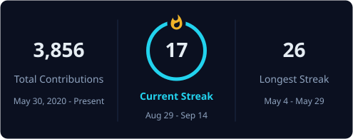

Ask a tax question. Get an answer with a citation. Sounds simple.

Now make it true for Indian tax law, where the statute was amended in 2017, three benches disagree, and the circular that settles it landed last March.

That is the problem I work on.

**AI Engineer at AskSolique.**

---

## What I actually build

Most AI answers are confident. Very few are checkable.

I build the part that makes them checkable. Retrieval that knows a Supreme Court judgment outranks a practitioner's note. Fusion that knows the amendment replaced the rule it amended. A citation guard that reads the finished answer, finds the claim, and blocks it when the cited source does not actually say that.

The model is the easy part. The evidence is the whole job.

---

## System architecture

`sources → ingestion → parse & normalize → regulatory metadata → sparse + dense indexes → query understanding → hybrid retrieval → RRF fusion → rerank → grounded reasoning → structured decision → provenance record`

---

## Why this is not just semantic search

**Not all sources are equal.** A Supreme Court judgment and a practitioner's note are both text. Only one of them ends an argument.

**"What is the rule" is an incomplete question.** The complete one ends with "as at when".

**Right document, wrong version, still wrong.** Amendments supersede. Retrieval has to know the date, not just the topic.

**Sources disagree, and that is normal.** Averaging two conflicting authorities gives you an answer that is true nowhere. Surface the conflict instead.

**A citation is not a link.** It is a span of text that contains the claim. Anything looser is decoration.

**Sometimes the right answer is "not enough evidence".** Thin retrieval should lower confidence, not raise word count.

---

## Failure modes and the controls that stop them

---

## How I work

**Retrieval before generation.** When the answer is wrong, the evidence was usually wrong first.

**Evidence before confidence.** A score with no passages behind it is a guess with better formatting.

**Evaluation before deployment.** Blind the judge, run the set, compare, then ship.

**Structure over prose.** If a machine reads it next, hand it a schema, not a paragraph.

**Provenance by default.** Sources, versions, trace id. Every answer, every time.

**Escalate, do not decide.** When the stakes are real, the system's job is to put evidence in front of a human.

---

## Capabilities

| Domain | Detail |
| :--- | :--- |
| **Retrieval** | BM25 · kNN vector search · reciprocal rank fusion · query expansion · metadata and date filtering · cross-encoder and LLM reranking |
| **Reasoning** | RAG orchestration · multi-agent deliberation · planner and researcher agents · structured generation · tool calling · citation guards |
| **Data** | Regulatory parsing · ETL · chunking and metadata strategy · lineage · PostgreSQL · OpenSearch |
| **Reliability** | Blinded LLM evaluation harnesses · guardrails · provenance · audit trails · distributed tracing · PII redaction |
| **Delivery** | Python · FastAPI · SSE streaming · async pipelines · Docker |
| **Scale** | Real-time systems · concurrent state · event-driven architecture · low-latency engineering · Luau |

&nbsp;

&nbsp;

&nbsp;

&nbsp;

---

## Where the instinct came from

Before tax law, I built games.

Roblox systems across experiences with more than **300 million player visits**. Real-time multiplayer state. Distributed events. Economies that break the instant one number is wrong.

People assume that was a different career. It was the same one. A desynced game state and an unsupported tax answer fail in exactly the same way: quietly, confidently, and only in front of the person who checks.

**M.Sc. Computer Games Technology**, University of London.

---

## What I am working on now

- Evaluation harnesses that catch a retrieval regression before it reaches anyone
- Reranking that weighs authority and recency, not just similarity
- Confidence that means something, and abstention that triggers when it should
- Provenance that survives multi-step reasoning instead of dissolving in it
- Safety boundaries for agents that call tools inside regulated workflows

---

## GitHub

  

---

## Contact

&nbsp;

&nbsp;

